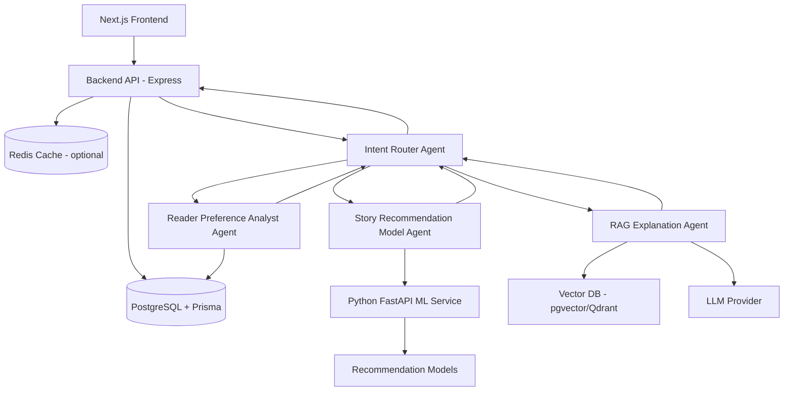

# Personalized Vietnamese Story Recommendation Platform with Machine Learning and RAG

Tên CV đề xuất:

- **Personalized Vietnamese Story Recommendation Platform with Machine Learning and RAG**
- **AI-powered Book/Story Recommendation and Reader Preference Analytics System**
- **Multi-Agent Vietnamese Story Recommendation Platform with RAG Explanations**

## 1. Mục tiêu dự án

Xây dựng một web app gợi ý truyện chữ/sách cá nhân hóa, nơi người dùng có thể đăng ký, xem danh sách truyện, đọc thông tin chi tiết, viết review, nhận gợi ý truyện phù hợp, xem lý do hệ thống gợi ý và hỏi AI về truyện bằng kiến trúc multi-agent kết hợp RAG.

Dự án chuyển hướng hoàn toàn từ domain phim sang domain truyện chữ. Dữ liệu chính dùng cho MVP là bộ dữ liệu sách/truyện hiện có trong workspace:

- `book_data.csv`: metadata gốc của sách/truyện.
- `prepared_data_book.csv`: metadata đã xử lý, có thêm `discount` và một số giá trị chuẩn hóa.
- `book_id.csv`: danh sách product id.
- `comments.csv/comments.csv`: review/comment của người đọc, gồm rating và nội dung đánh giá.
- `output/`: các file `.txt` chứa nội dung truyện/sách; MVP chỉ lưu đường dẫn file, chưa import full text vào database.

### Người dùng có thể làm gì?

1. Đăng ký / đăng nhập.
2. Xem danh sách truyện/sách phổ biến.
3. Tìm kiếm truyện theo tên, tác giả hoặc thể loại.
4. Xem chi tiết truyện: bìa, tác giả, thể loại, nhà xuất bản, số trang, giá, giảm giá, rating, số review và đường dẫn nội dung text.
5. Viết review đầy đủ gồm điểm 1–5 sao, tiêu đề và nội dung nhận xét.
6. Xem review/comment từ dữ liệu import ban đầu.
7. Nhận danh sách truyện được gợi ý cá nhân hóa.
8. Xem lý do vì sao truyện được gợi ý.
9. Xem dashboard sở thích đọc của bản thân.
10. Hỏi AI Story Assistant về truyện, gu đọc và đề xuất truyện.
11. Được hệ thống multi-agent hiểu intent, phân tích sở thích, gọi model gợi ý phù hợp và giải thích kết quả bằng RAG.

### Ví dụ use case

Người dùng đánh giá cao:

- Cây Cam Ngọt Của Tôi
- Nhà Giả Kim
- Điều Kỳ Diệu Của Tiệm Tạp Hóa NAMIYA

Hệ thống gợi ý:

- Một Thoáng Ta Rực Rỡ Ở Nhân Gian
- 11 phút
- 4 cô con gái nhà bác sỹ March
- AQ Chính Truyện
- An Lạc Từng Bước Chân

Lý do:

> Bạn có xu hướng thích truyện giàu cảm xúc, có yếu tố chữa lành, suy ngẫm về cuộc sống và nhịp kể nhẹ nhàng. Những truyện này có điểm đánh giá cao, nhiều review tích cực và gần với nhóm thể loại bạn thường đánh giá tốt.

---

## 2. Phạm vi MVP

MVP nên tập trung vào sản phẩm có thể demo tốt trong 3–4 tuần, không cố làm tất cả ở mức production ngay từ đầu.

### Bắt buộc có trong MVP

- Web app có giao diện rõ ràng.
- User auth cơ bản.
- Import dữ liệu truyện/sách từ các file CSV hiện có.
- Sắp xếp dữ liệu thô vào đúng vị trí trong `data/raw/`.
- Story list + story detail.
- Review flow đầy đủ: rating 1–5 sao, tiêu đề review, nội dung review.
- Import comment/review ban đầu từ `comments.csv/comments.csv`.
- Lưu aggregate rating trên truyện để list nhanh.
- Lưu path tới file nội dung trong `output/`, chưa import full text vào DB ở MVP.
- Recommendation cơ bản và nâng cao vừa đủ:
  - Popularity-based.
  - Content-based filtering.
  - Matrix Factorization / SVD hoặc thuật toán collaborative filtering tương đương.
  - Hybrid recommendation.
- User preference dashboard.
- Recommendation explanation.
- Multi-agent AI Story Assistant dùng RAG.
- Luồng điều phối 4 agent:
  - Intent Router Agent.
  - Reader Preference Analyst Agent.
  - Story Recommendation Model Agent.
  - RAG Explanation Agent.
- Model metrics dashboard.
- README + demo video + mô tả CV.

### Chưa cần làm ở MVP

- Payment / mua sách trực tiếp.
- Social network / follow user.
- Real-time notification.
- Admin dashboard phức tạp.
- A/B testing production.
- Recommendation model quá nặng như full neural ranking system.
- Import full nội dung `.txt` vào database.
- Vector hóa toàn bộ nội dung truyện ngay từ ngày đầu.

---

## 3. Stack đề xuất

### Frontend

- Next.js App Router.
- TypeScript.
- Tailwind CSS hoặc CSS module hiện có.
- shadcn/ui nếu muốn polish giao diện.
- Recharts cho dashboard sở thích đọc và model metrics.

### Backend API

- Express.js: đơn giản, nhanh, phù hợp MVP.
- Zod để validate request.
- JWT auth cho MVP.

### Database

- PostgreSQL.
- Prisma ORM.
- pgvector nếu muốn dùng vector search ngay trong PostgreSQL ở giai đoạn RAG.

### Cache

- Redis cho cache story list, popular stories, recommendation results nếu cần tối ưu sau MVP nền tảng.

### ML Service

- Python.
- FastAPI.
- Pandas.
- NumPy.
- Scikit-learn.
- Surprise, LightFM hoặc implicit/collaborative filtering library tương đương.
- joblib / pickle để lưu model.

### RAG

- LangChain hoặc retrieval pipeline tự viết đơn giản.
- pgvector hoặc Qdrant.
- Claude / OpenAI / Gemini API tùy cấu hình.

### Dataset

- `book_data.csv`: metadata sách/truyện từ Tiki.
- `prepared_data_book.csv`: metadata đã chuẩn hóa, có giá trị giá/discount đã xử lý.
- `book_id.csv`: danh sách product id.
- `comments.csv/comments.csv`: dữ liệu review/comment.
- `output/*.txt`: nội dung truyện/sách dạng text; MVP chỉ lưu path.

---

## 4. Kiến trúc tổng quan



### Luồng chính

1. User đăng nhập vào web app.
2. User xem, tìm kiếm và review truyện.
3. Backend lưu review vào PostgreSQL và cập nhật aggregate rating trên story.
4. Import script nạp dữ liệu metadata từ CSV, import review/comment từ `comments.csv`, và gắn `contentPath` tới file `.txt` trong `output/` nếu match được theo title/author.
5. Khi user cần gợi ý hoặc hỏi AI, backend gửi request đến Intent Router Agent.
6. Intent Router Agent hiểu câu hỏi, phân loại intent và quyết định gọi agent tiếp theo.
7. Reader Preference Analyst Agent phân tích lịch sử review, thể loại yêu thích, tác giả yêu thích, khoảng giá/số trang thường quan tâm và độ đa dạng gu đọc.
8. Story Recommendation Model Agent gọi các mô hình popularity, content-based, collaborative filtering hoặc hybrid để lấy danh sách truyện ứng viên.
9. RAG Explanation Agent retrieve story metadata, review history, imported comments, content path/preview và recommendation results để tạo lý do gợi ý có căn cứ.
10. Intent Router Agent tổng hợp kết quả từ các agent và trả về backend.
11. Frontend hiển thị truyện được gợi ý, score, reason và câu trả lời AI nếu user đang chat.

### Thiết kế 4 agent chính

#### 1. Intent Router Agent

Vai trò:

- Nhận câu hỏi hoặc hành động từ người dùng.
- Hiểu người dùng đang muốn làm gì.
- Phân loại intent: hỏi thông tin truyện, xin gợi ý, hỏi lý do gợi ý, phân tích gu đọc, hoặc thao tác review.
- Quyết định gọi agent nào tiếp theo và tổng hợp kết quả cuối cùng.

Input ví dụ:

```json
{
  "message": "Tôi muốn đọc truyện giống Cây Cam Ngọt Của Tôi nhưng nhẹ nhàng hơn",
  "userId": "user_123"
}
```

Output ví dụ:

```json
{
  "intent": "recommendation_request",
  "nextAgents": ["reader_preference_analyst", "story_recommendation_model", "rag_explanation"],
  "constraints": {
    "similarTo": "Cây Cam Ngọt Của Tôi",
    "tone": "lighter"
  }
}
```

#### 2. Reader Preference Analyst Agent

Vai trò:

- Phân tích sở thích đọc của người dùng từ review history.
- Tính favorite categories, favorite authors, average rating by category, rating variance và reading diversity.
- Tạo reader preference profile để recommendation model và RAG explanation dùng lại.

Output ví dụ:

```json
{
  "favoriteCategories": ["Tiểu Thuyết", "Truyện ngắn - Tản văn - Tạp Văn", "Tác phẩm kinh điển"],
  "favoriteAuthors": ["José Mauro de Vasconcelos", "Paulo Coelho", "Higashino Keigo"],
  "highRatedStories": ["Cây Cam Ngọt Của Tôi", "Nhà Giả Kim"],
  "insight": "User thích truyện giàu cảm xúc, có chiều sâu nội tâm và thông điệp chữa lành."
}
```

#### 3. Story Recommendation Model Agent

Vai trò:

- Gọi các mô hình gợi ý truyện phù hợp với intent.
- Chọn strategy theo dữ liệu người dùng:
  - User mới: popularity-based.
  - User có vài review: content-based.
  - User có đủ review: collaborative filtering hoặc hybrid.
- Trả về danh sách truyện ứng viên kèm score và model name.

Output ví dụ:

```json
{
  "modelName": "hybrid_story_v1",
  "recommendations": [
    {
      "storyId": "story_42",
      "title": "Một Thoáng Ta Rực Rỡ Ở Nhân Gian",
      "score": 0.91
    }
  ]
}
```

#### 4. RAG Explanation Agent

Vai trò:

- Kết hợp RAG với kết quả recommendation để giải thích vì sao truyện được gợi ý.
- Retrieve story metadata, category, author, publisher, review/comment snippets, rating history và reader preference profile.
- Tạo câu trả lời tự nhiên, có căn cứ, không bịa thông tin ngoài retrieved context.

Output ví dụ:

```json
{
  "answer": "Bạn có thể thử Một Thoáng Ta Rực Rỡ Ở Nhân Gian vì bạn từng đánh giá cao các truyện giàu cảm xúc và có chiều sâu nội tâm. Truyện này cùng nhóm tiểu thuyết giàu suy ngẫm, có rating cao và nhiều review tích cực.",
  "citations": ["story:Một Thoáng Ta Rực Rỡ Ở Nhân Gian", "reader_preference:Tiểu Thuyết", "review_history:Cây Cam Ngọt Của Tôi"]
}
```

---

## 5. Database schema đề xuất

### `users`

- `id`
- `email`
- `password_hash`
- `name`
- `created_at`
- `updated_at`

### `stories`

- `id`
- `product_id`: id gốc từ dataset.
- `title`
- `authors`
- `original_price`
- `current_price`
- `discount`
- `quantity`
- `category_id`
- `average_rating`
- `review_count`
- `pages`
- `manufacturer`: nhà xuất bản/đơn vị phát hành nếu dữ liệu có.
- `cover_url`
- `content_path`: đường dẫn file `.txt` trong `data/raw/stories/output/`, nếu match được.
- `created_at`
- `updated_at`

### `categories`

- `id`
- `name`

### `reviews`

- `id`
- `user_id`: nullable với review import từ dataset nếu chỉ có `external_customer_id`.
- `story_id`
- `external_customer_id`: customer id từ `comments.csv`.
- `external_comment_id`: comment id từ `comments.csv`.
- `rating`
- `title`
- `content`
- `thank_count`
- `source`: `imported` hoặc `user`.
- `reviewed_at`
- `created_at`
- `updated_at`

### `recommendations`

- `id`
- `user_id`
- `story_id`
- `score`
- `model_name`
- `reason`
- `created_at`

### `reader_preferences`

- `id`
- `user_id`
- `favorite_categories`
- `favorite_authors`
- `review_count`
- `rating_average`
- `rating_variance`
- `reading_diversity`
- `updated_at`

### `model_runs`

- `id`
- `model_name`
- `version`
- `rmse`
- `mae`
- `precision_at_10`
- `recall_at_10`
- `ndcg_at_10`
- `coverage`
- `trained_at`

### `chat_sessions`

- `id`
- `user_id`
- `title`
- `created_at`

### `chat_messages`

- `id`
- `session_id`
- `role`
- `content`
- `created_at`

### `story_embeddings`

- `id`
- `story_id`
- `embedding`
- `source_text`
- `metadata`
- `created_at`

---

## 6. API cần có

### Auth API

```http
POST /auth/register
POST /auth/login
GET /auth/me
```

### Story API

```http
GET /stories
GET /stories/:id
GET /stories/popular
GET /stories/search?q=cay%20cam%20ngot
```

### Review API

```http
POST /reviews
GET /reviews/me
GET /stories/:id/reviews
PUT /reviews/:id
DELETE /reviews/:id
```

### Reader Preference API

```http
GET /users/me/preferences
GET /users/me/dashboard
```

### Recommendation API

```http
GET /recommendations/me
POST /recommendations/generate
GET /recommendations/me/explanations
```

### Model Runs API

```http
GET /model-runs
GET /model-runs/latest
```

### AI Story Assistant API

```http
POST /chat/story-assistant
GET /chat/sessions
GET /chat/sessions/:id/messages
```

### Multi-Agent API

```http
POST /agents/route
POST /agents/analyze-preferences
POST /agents/recommend
POST /agents/explain
```

Gợi ý mapping:

- `POST /agents/route`: Intent Router Agent nhận message và quyết định luồng xử lý.
- `POST /agents/analyze-preferences`: Reader Preference Analyst Agent phân tích gu đọc.
- `POST /agents/recommend`: Story Recommendation Model Agent gọi model gợi ý.
- `POST /agents/explain`: RAG Explanation Agent tạo giải thích và câu trả lời có căn cứ.

### ML Service API

```http
POST /predict-rating
POST /recommend
POST /similar-stories
GET /model/metrics
```

### RAG Service API

```http
POST /rag/ingest-stories
POST /rag/query
```

---

## 7. Roadmap MVP 4 tuần

## Tuần 1: Web base + data + review flow

### Mục tiêu tuần 1

Có nền tảng web app chạy được, database có dữ liệu truyện/sách, user có thể đăng nhập và viết review truyện.

### Ngày 1: Chuẩn hóa project và dữ liệu thô

Task:

- Giữ cấu trúc project hiện tại: `frontend/`, `backend/`, `ai/`, `data/`.
- Di chuyển dữ liệu truyện vào đúng vị trí:
  - `data/raw/books/book_data.csv`
  - `data/raw/books/book_id.csv`
  - `data/raw/books/prepared_data_book.csv`
  - `data/raw/books/comments.csv`
  - `data/raw/books/output/*.txt`
- Cập nhật README và `.env.example` từ hướng phim sang hướng truyện.
- Đổi tên Docker/PostgreSQL database từ movie-oriented sang story/book-oriented nếu cần.

Output cần có:

- Dữ liệu raw nằm đúng chỗ.
- Frontend/backend vẫn chạy local.
- Tài liệu không còn mô tả MovieLens là dataset chính.

### Ngày 2: Database schema và import dữ liệu truyện

Task:

- Đổi Prisma schema từ `Movie`, `Genre`, `MovieGenre`, `Rating` sang `Story`, `Category`, `Review`.
- Lưu metadata từ `prepared_data_book.csv` hoặc `book_data.csv`.
- Deduplicate theo `product_id`.
- Import category.
- Import aggregate rating: `avg_rating`, `n_review`.
- Match file `.txt` trong `output/` để lưu `content_path` nếu có thể.
- Viết test parser/import cho dữ liệu CSV.

Output cần có:

- Database có `stories`.
- Database có `categories`.
- Story có rating aggregate, giá, số trang, publisher, cover.
- Có thể query danh sách truyện từ backend.

### Ngày 3: Auth cơ bản

Task:

- Giữ register/login hiện có.
- Hash password.
- JWT auth.
- Middleware bảo vệ route.
- Frontend có form login/register.

Output cần có:

- User tạo account được.
- User login được.
- Frontend lưu token ở mức MVP.
- API `/auth/me` trả về current user.

### Ngày 4: Story list và story detail

Task:

- API `GET /stories` có pagination và search.
- API `GET /stories/:id`.
- Trang Home hiển thị truyện phổ biến.
- Trang Story Detail hiển thị title, author, category, average rating, review count, cover, pages, publisher, price, discount và content path.
- Đổi toàn bộ route frontend từ `/movies/[id]` sang `/stories/[id]`.

Output cần có:

- Người dùng xem được danh sách truyện.
- Người dùng mở được chi tiết truyện.
- UI nhìn giống mini story/book catalog.

### Ngày 5: Review flow

Task:

- API `POST /reviews`.
- API `GET /reviews/me`.
- API `GET /stories/:id/reviews`.
- Component review gồm rating sao, tiêu đề và nội dung.
- Lưu review vào database.
- Nếu user review lại cùng truyện thì update review cũ hoặc cho phép nhiều review theo quyết định product; MVP nên dùng một review/user/story để đơn giản.
- Sau khi review, cập nhật `average_rating` và `review_count` trên `stories`.

Output cần có:

- User viết review truyện được.
- Review hiển thị lại đúng sau refresh.
- Database có review history theo user.
- Story list/detail cập nhật rating aggregate.

### Cuối tuần 1: Tiêu chí hoàn thành

- Có web app chạy được.
- Có auth.
- Có dữ liệu truyện/sách.
- Có story list/detail.
- Có review flow đầy đủ.

---

## Tuần 2: Recommendation model

### Mục tiêu tuần 2

Có hệ thống recommendation thật sự, bắt đầu từ baseline rồi nâng lên content-based và collaborative filtering.

### Ngày 6: Popularity-based recommendation

Task:

- Tính average rating và review count cho mỗi story.
- Tạo score popularity.
- Loại bỏ truyện user đã review.
- API `GET /recommendations/me` trả popular recommendation nếu user chưa có đủ review.

Công thức đơn giản:

```text
popularity_score = average_rating * log(1 + review_count)
```

Output cần có:

- User mới vẫn nhận được gợi ý truyện phổ biến.
- Recommendation không trả truyện user đã review.

### Ngày 7: Content-based recommendation bằng category/author/metadata

Task:

- Tạo feature text cho mỗi story.
- Dùng title + authors + category + manufacturer + pages + price bucket + imported review keywords nếu có.
- TF-IDF vectorization.
- Cosine similarity.
- Với user, lấy các truyện user rating cao để tạo preference vector.

Ví dụ source text:

```text
Cây Cam Ngọt Của Tôi José Mauro de Vasconcelos Tiểu Thuyết Nhà Xuất Bản Hội Nhà Văn emotional healing childhood classic
```

Output cần có:

- API hoặc script trả truyện tương tự một truyện.
- User thích tiểu thuyết/chữa lành sẽ nhận nhiều truyện cùng vibe hơn.

### Ngày 8: FastAPI ML service

Task:

- Setup FastAPI service trong `ai/`.
- Endpoint `/similar-stories`.
- Endpoint `/recommend`.
- Load model/vectorizer từ file.
- Backend gọi ML service.

Output cần có:

- ML service chạy riêng.
- Backend gọi được ML service.
- Frontend hiển thị recommendation từ ML service.

### Ngày 9: Collaborative filtering / Matrix Factorization

Task:

- Chuẩn bị review/rating train/test từ `comments.csv` và review do user tạo.
- Train baseline global average.
- Train SVD hoặc collaborative filtering model tương đương.
- Tính RMSE và MAE.
- Save model bằng joblib/pickle.

Metric cần log:

- RMSE.
- MAE.

Output cần có:

- Có model collaborative filtering được train.
- Có file model đã lưu.
- Có metrics lưu vào `model_runs`.

### Ngày 10: Top-N recommendation evaluation

Task:

- Sinh Top 10 truyện cho user.
- Đánh giá Precision@10.
- Đánh giá Recall@10.
- Đánh giá NDCG@10.
- Lưu kết quả vào `model_runs`.

Output cần có:

- Có bảng metrics.
- Có thể so sánh popularity vs content-based vs collaborative filtering.

### Cuối tuần 2: Tiêu chí hoàn thành

- Có popularity recommendation.
- Có content-based recommendation.
- Có collaborative filtering model.
- Có FastAPI ML service.
- Có metrics cơ bản.

---

## Tuần 3: Hybrid recommendation + dashboard

### Mục tiêu tuần 3

Kết hợp nhiều model, giải thích lý do gợi ý và hiển thị dashboard sở thích đọc của người dùng.

### Ngày 11: Hybrid recommendation

Task:

- Lấy collaborative score từ model rating/review.
- Lấy content similarity score từ TF-IDF/cosine.
- Lấy popularity score.
- Normalize score về cùng thang.
- Kết hợp thành final score.

Công thức MVP:

```text
final_score = 0.6 * collaborative_score
            + 0.3 * content_similarity_score
            + 0.1 * popularity_score
```

Output cần có:

- Endpoint `/recommend` trả hybrid recommendation.
- Mỗi story có `score` và `model_name`.

### Ngày 12: Recommendation explanation

Task:

- Tạo reason đơn giản dựa trên category/author/user history/imported comments.
- Nếu user thích nhiều truyện cùng category, giải thích theo category.
- Nếu truyện giống truyện user từng rating cao, nêu truyện tham chiếu.
- Nếu có review/comment tích cực nổi bật, dùng làm tín hiệu giải thích.

Ví dụ reason:

```text
Gợi ý vì bạn đã đánh giá cao Cây Cam Ngọt Của Tôi và Nhà Giả Kim. Truyện này cùng nhóm tiểu thuyết giàu cảm xúc, có nhiều review tích cực và rating cao.
```

Output cần có:

- Recommendation hiển thị lý do.
- Reason được lưu trong bảng `recommendations`.

### Ngày 13: Reader preference analytics

Task:

- Tính average rating by category.
- Tính favorite categories.
- Tính favorite authors.
- Tính review count.
- Tính rating variance.
- Tính reading diversity.
- Tính price/page preference nếu muốn tận dụng dữ liệu thương mại.

Output cần có:

- API `/users/me/preferences`.
- Dữ liệu preference được cập nhật sau khi user review.

### Ngày 14: Reader Preference Dashboard

Task:

- UI dashboard bằng Recharts.
- Chart rating by category.
- Chart favorite categories.
- List favorite authors.
- Summary insight bằng text.
- Có thể hiển thị khoảng giá/số trang user thường thích nếu có đủ dữ liệu.

Ví dụ insight:

```text
Bạn thích nhất: Tiểu Thuyết, Tác phẩm kinh điển, Truyện ngắn - Tản văn - Tạp Văn.
Bạn thường chấm cao các truyện có sắc thái chữa lành, suy ngẫm và nhân văn.
Gu đọc của bạn khá tập trung vào truyện giàu cảm xúc.
```

Output cần có:

- Dashboard trực quan.
- Có insight dễ hiểu.
- Có thể demo gu đọc của user.

### Ngày 15: Model Dashboard

Task:

- API `GET /model-runs`.
- UI hiển thị RMSE, MAE, Precision@10, Recall@10, NDCG@10.
- So sánh các model.
- Hiển thị model đang dùng cho recommendation.

Output cần có:

- Có trang model metrics.
- Người xem demo thấy được phần data science rõ ràng.

### Cuối tuần 3: Tiêu chí hoàn thành

- Có hybrid recommendation.
- Có reason cho từng recommendation.
- Có dashboard sở thích đọc.
- Có model dashboard.

---

## Tuần 4: RAG Story Assistant + hoàn thiện demo

### Mục tiêu tuần 4

Thêm AI Story Assistant dùng RAG, hoàn thiện deploy/local demo, README, demo video và phần trình bày CV.

### Ngày 16: Chuẩn bị dữ liệu RAG

Task:

- Tạo `source_text` cho mỗi story.
- Kết hợp title, authors, category, manufacturer, rating statistics, review snippets và content path.
- Với MVP, không bắt buộc import full text; có thể tạo source text từ metadata và review trước.
- Nếu còn thời gian, đọc một đoạn đầu từ file `.txt` để tạo preview/chunk phục vụ RAG.
- Generate embeddings.
- Lưu vào `story_embeddings`.

Ví dụ `source_text`:

```text
Title: Cây Cam Ngọt Của Tôi
Authors: José Mauro de Vasconcelos
Category: Tiểu Thuyết
Publisher: Nhà Xuất Bản Hội Nhà Văn
Average rating: 5.0
Review count: 11481
Review signal: cảm động, chữa lành, tuổi thơ, yêu thương
Content path: data/raw/books/output/Cây Cam Ngọt Của Tôi - José Mauro de Vasconcelos.txt
```

Output cần có:

- Có embeddings cho stories.
- Có thể search truyện liên quan bằng vector similarity.

### Ngày 17: Multi-agent orchestration + RAG query pipeline

Task:

- Xây Intent Router Agent để nhận câu hỏi user, hiểu intent và quyết định agent tiếp theo.
- Xây Reader Preference Analyst Agent để lấy preference profile từ review history.
- Xây Story Recommendation Model Agent để gọi popularity/content-based/collaborative/hybrid recommendation.
- Xây RAG Explanation Agent để retrieve context và giải thích kết quả.
- Retrieve story metadata liên quan.
- Retrieve user review history.
- Retrieve recommendation results.
- Retrieve imported comments/review snippets.
- Tạo prompt cho LLM.
- Trả lời có căn cứ.

Input ví dụ:

```text
Tôi muốn đọc truyện giống Cây Cam Ngọt Của Tôi nhưng ít buồn hơn.
```

Output ví dụ:

```text
Bạn có thể thử Điều Kỳ Diệu Của Tiệm Tạp Hóa NAMIYA hoặc Nhà Giả Kim. Cả hai đều có yếu tố chữa lành và suy ngẫm, nhưng nhịp kể nhẹ hơn và ít tập trung vào bi kịch tuổi thơ.
```

### Ngày 18: AI Story Chat UI

Task:

- Trang AI Story Chat.
- Chat input.
- Chat history.
- Hiển thị story cards trong câu trả lời nếu có.
- Lưu chat sessions và messages.

Output cần có:

- User hỏi đáp được với AI.
- Câu trả lời dùng dữ liệu truyện, review và preference history.

### Ngày 19: Polish UI và deploy/local demo

Task:

- Làm UI nhất quán.
- Loading state.
- Empty state.
- Error state cơ bản.
- Chuẩn bị deploy hoặc hướng dẫn demo local.
- Setup env production nếu deploy.

Output cần có:

- Có link demo hoặc video demo local.
- App đủ mượt để quay video.

### Ngày 20: README, CV, demo video

Task:

- Viết README.
- Thêm architecture diagram.
- Thêm screenshots.
- Thêm model metrics.
- Viết phần mô tả CV.
- Quay demo video 2–4 phút.

Output cần có:

- README chuyên nghiệp.
- Demo video.
- CV bullet points.

### Cuối tuần 4: Tiêu chí hoàn thành

- Có RAG Story Assistant.
- Có deploy hoặc video demo rõ ràng.
- Có README tốt.
- Có phần mô tả CV.

---

## 8. Chi tiết ML plan

## Bài toán 1: Rating Prediction

Mục tiêu: dự đoán user sẽ chấm một truyện bao nhiêu sao.

Input:

- `user_id`
- `story_id`
- `story_category`
- `story_author`
- `story_average_rating`
- `story_review_count`
- `user_review_history`
- `user_average_rating`

Output:

```text
predicted_rating = 4.3 / 5
```

Model:

1. Global average rating.
2. User average + story average.
3. Matrix Factorization / SVD.
4. Neural Collaborative Filtering nếu còn thời gian.

Metric:

- RMSE.
- MAE.

## Bài toán 2: Top-N Recommendation

Mục tiêu: gợi ý Top 10 truyện phù hợp với user.

Output:

```text
Top 10 stories for user
```

Metric:

- Precision@10.
- Recall@10.
- NDCG@10.
- MAP@10.
- Hit Rate@10.

## Bài toán 3: Content-based Recommendation

Feature:

- Category.
- Authors.
- Title.
- Manufacturer/publisher.
- Price bucket.
- Pages bucket.
- Review keywords từ `comments.csv`.
- Optional preview/chunk từ file `.txt` trong `output/`.

Model/cách làm:

- TF-IDF + Cosine Similarity.
- Sentence Embedding + Cosine Similarity nếu còn thời gian.

## Bài toán 4: Reader Preference Analytics

Feature tạo ra:

- `average_rating_by_category`
- `favorite_categories`
- `favorite_authors`
- `review_count`
- `rating_average`
- `rating_variance`
- `reading_diversity`
- `preferred_price_range`
- `preferred_page_range`
- `recency_weighted_preference`

Dashboard hiển thị:

- Bạn thích nhất thể loại nào.
- Bạn thường chấm cao tác giả/nhóm truyện nào.
- Bạn thích truyện ngắn hay dài.
- Bạn quan tâm nhóm giá nào.
- Gu đọc của bạn đa dạng hay tập trung.

---

## 9. RAG dùng để làm gì?

RAG không dùng để train recommendation model. RAG dùng để tạo AI Story Assistant trả lời có căn cứ từ dữ liệu truyện, review/comment và lịch sử người dùng.

### User có thể hỏi

- Tôi muốn đọc truyện giống Cây Cam Ngọt Của Tôi nhưng ít buồn hơn.
- Tại sao hệ thống gợi ý Nhà Giả Kim cho tôi?
- Tôi thích truyện tâm lý nhẹ nhàng, nên đọc gì tiếp?
- Cho tôi 5 truyện có yếu tố chữa lành và suy ngẫm.
- Tôi muốn truyện không quá dài, rating cao, giá mềm.

### RAG retrieve từ đâu?

- Story metadata.
- Category.
- Authors.
- Publisher/manufacturer.
- Review/comment snippets.
- User review history.
- Recommendation results.
- Story similarity results.
- Content path hoặc preview từ `output/*.txt` nếu đã xử lý.

### Câu trả lời tốt cần có

- Gợi ý truyện cụ thể.
- Lý do dựa trên dữ liệu.
- Không bịa thông tin không có trong context.
- Có liên hệ với review history của user.
- Có thể trích dẫn metadata/review snippets làm căn cứ.

---

## 10. Checklist hoàn thành dự án

### Product

- [ ] User đăng ký / đăng nhập được.
- [ ] User xem danh sách truyện được.
- [ ] User xem chi tiết truyện được.
- [ ] User viết review truyện được.
- [ ] User xem review/comment của truyện được.
- [ ] User nhận recommendation cá nhân hóa được.
- [ ] User thấy lý do gợi ý.
- [ ] User xem dashboard sở thích đọc.
- [ ] User hỏi AI Story Assistant.

### Data

- [ ] Di chuyển dữ liệu raw vào `data/raw/books/`.
- [ ] Import `book_data.csv` hoặc `prepared_data_book.csv`.
- [ ] Import `book_id.csv` nếu cần đối chiếu product id.
- [ ] Import `comments.csv/comments.csv` thành reviews.
- [ ] Import categories.
- [ ] Lưu `content_path` tới file `.txt` trong `output/` nếu match được.
- [ ] Deduplicate story theo `product_id`.
- [ ] Giữ metadata thương mại: giá gốc, giá hiện tại, số lượng, discount.

### Machine Learning

- [ ] Popularity baseline.
- [ ] Content-based filtering.
- [ ] Collaborative filtering / SVD.
- [ ] Hybrid recommendation.
- [ ] RMSE/MAE.
- [ ] Precision@10/Recall@10/NDCG@10.
- [ ] Model metrics dashboard.

### Multi-Agent

- [ ] Intent Router Agent nhận message và phân loại intent.
- [ ] Intent Router Agent quyết định gọi agent tiếp theo.
- [ ] Reader Preference Analyst Agent tạo preference profile từ review history.
- [ ] Story Recommendation Model Agent gọi đúng model theo context người dùng.
- [ ] RAG Explanation Agent tạo reason/câu trả lời có căn cứ.
- [ ] Luồng agent end-to-end hoạt động từ chat UI đến kết quả gợi ý.

### RAG

- [ ] Tạo source text cho stories.
- [ ] Generate embeddings.
- [ ] Vector search hoạt động.
- [ ] Chat API hoạt động.
- [ ] Chat UI hoạt động.
- [ ] RAG Explanation Agent dùng retrieved context để trả lời.
- [ ] Câu trả lời có căn cứ từ retrieved context.

### Demo/CV

- [ ] README có architecture diagram.
- [ ] README có screenshots.
- [ ] README có model metrics.
- [ ] README có cách chạy project.
- [ ] Có video demo 2–4 phút.
- [ ] Có CV bullet points.

---

## 11. README nên có gì?

README nên gồm:

1. Project title.
2. Demo link hoặc demo video.
3. Screenshots.
4. Features.
5. Architecture diagram.
6. Tech stack.
7. Dataset.
8. Recommendation approach.
9. Multi-agent architecture: Intent Router, Reader Preference Analyst, Story Recommendation Model, RAG Explanation.
10. ML metrics.
11. RAG pipeline.
12. Database schema summary.
13. How to run locally.
14. Future improvements.

---

## 12. CV bullet points đề xuất

Bạn có thể ghi trong CV:

- Built a multi-agent Vietnamese story recommendation platform using Next.js, Express.js, PostgreSQL, FastAPI, and Machine Learning.
- Designed an agent orchestration flow with Intent Router, Reader Preference Analyst, Story Recommendation Model, and RAG Explanation agents.
- Developed hybrid recommendation models combining collaborative filtering, content-based similarity, and popularity-based ranking.
- Trained and evaluated collaborative filtering models on book/story review data using RMSE, MAE, Precision@10, Recall@10, and NDCG@10.
- Designed a reader preference analytics dashboard to visualize favorite categories, authors, rating behavior, review patterns, and recommendation explanations.
- Implemented a RAG-based AI Story Assistant using story metadata, imported reviews, user review history, vector search, and LLM-generated grounded responses.

---

## 13. Thứ tự làm khuyến nghị nếu bạn mới bắt đầu

Nếu bạn chưa có gì cả, hãy đi theo thứ tự này:

1. Chuẩn hóa dữ liệu raw vào `data/raw/books/`.
2. Đổi database schema từ movie sang story.
3. Import stories trước, reviews sau.
4. Làm story list/detail.
5. Làm auth.
6. Làm review flow.
7. Làm popularity recommendation.
8. Làm content-based recommendation.
9. Làm FastAPI ML service.
10. Train collaborative filtering / SVD.
11. Làm hybrid recommendation.
12. Làm dashboard sở thích đọc.
13. Làm model dashboard.
14. Làm Intent Router Agent.
15. Làm Reader Preference Analyst Agent.
16. Làm Story Recommendation Model Agent.
17. Làm RAG Explanation Agent.
18. Tích hợp AI Story Chat UI với luồng multi-agent.
19. Polish UI.
20. Viết README.
21. Quay demo video.
22. Đưa vào CV.

---

## 14. Phiên bản đơn giản nhất nếu bị thiếu thời gian

Nếu chỉ có 1–2 tuần, hãy làm bản rút gọn:

- Next.js web app.
- PostgreSQL.
- Import book/story dataset.
- Story list/detail.
- Review flow.
- Popularity recommendation.
- Content-based recommendation bằng category/author/metadata.
- Dashboard sở thích đọc đơn giản.
- README + demo video.

Sau đó ghi CV là:

> Built a personalized Vietnamese story recommendation web app using content-based filtering and reader preference analytics.

Nếu có thêm thời gian, mới thêm:

- Collaborative filtering / SVD.
- Hybrid recommendation.
- Multi-agent AI Story Assistant.
- RAG chatbot.
- Model metrics dashboard.

---

## 15. Kết quả cuối cùng cần đạt

Sau khi hoàn thành, bạn nên có:

1. Một web app có thể demo.
2. Một recommendation system có nhiều cấp độ model.
3. Một dashboard thể hiện khả năng data analytics.
4. Một AI chatbot thể hiện RAG.
5. Một README chuyên nghiệp.
6. Một demo video.
7. Một dự án đủ mạnh để ghi CV hoặc portfolio.
